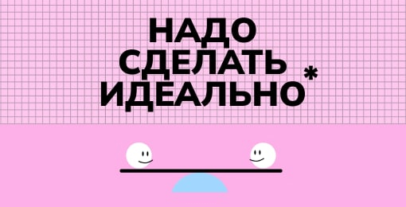

<h1>Надо сделать идеально</h1>

<h2>Описание</h2>

Страница о взгляде на перфекционизм в работе и учёбе. Сверстана под ширину экрана минимум 800px. Основными элементами являются заголовок и видео. При наведении на заголовок появляется тултип (блок с текстом). Оверлей, звездочка и тултип созданы как псевдоэлементы.

<h2>Технологии</h2>
<ul>
  <li>HTML (семантическая верстка);</li>
  <li>CSS (position, псевдоклассы, псевдоэлементы, видео);</li>
  <li>БЭМ.</li>
</ul>
<h2>Ссылка на макет</h2>
<a href="https://www.figma.com/file/8oKbCdYbLgfDehpQNJEoMS/%233-Надо-сделать-идеально?node-id=0%3A1&mode=dev">Открыть</a>
<h2>Ссылка на проект</h2>
<a href="">Открыть</a>